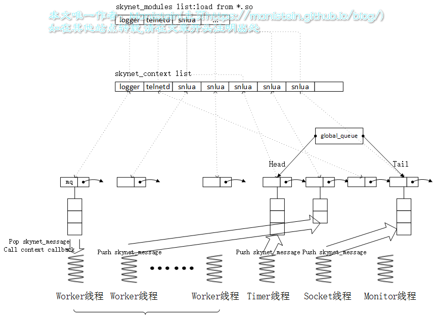
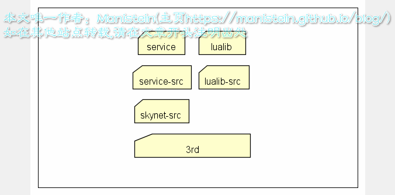

# skynet源码赏析
## 对于skynet，需要理清楚的几个问题
* skynet本质上解决什么问题？
* skynet有哪些基本的数据结构？
* skynet有几类线程，他们分别的作用是什么?
* skynet如何启动一个C服务？
* skynet消息高度是怎么样的？
* skynet如何启动一个Lua服务？
* skynet的lua层消息派发机制是怎样的？
* timer是如何产生消息的?它的结构和流程是怎么样的？
* 网络模块是如何产生消息的？它的结构和流程是怎么样的？
* skynet有哪些基本服务，它们的作用分别是什么
* skynet集群机制
## 概述
我们希望自己写的不同的业务逻辑，独立运行在不同的上下文环境中，并且能够通过某种方式，相互协作，最终共同服务于我们的玩家。skynet则为我们提供了这种环境：
* 我们编写好的C文件，在编译成so库后，在以后某个时机，调用该so库api句柄，会被加载到一个modules列表中，一般这样的模块会被要求定义4种接口**create, init, signal, release**
* 我们要创建一个新的，运行该业务逻辑的上下文环境时，则从modules列表中，找到对应的so库句柄，并且调用create接口，创建一个该业务模块的数据实例，并且创建一个上下文环境（context），引用该业务逻辑的接口和数据实例，该context会被存放到context列表中，这种context被称之为服务
* 一个服务默认不会执行任何逻辑，需要别人向它发出请求时，才会执行相对应的逻辑（定时器也是通过消息队列，告诉指定服务要执行定时事件），并在需要时返回结果给请求者。请求者往往也是其它服务。服务间的请求、响应和推送，并不是直接调用对方的api来执行，而是通过一个消息队列，也就是说，不论是请求、响应还是推送，都需要通过这个消息队列转发到另一个服务中。skynet的消息队列分为两级，一个是**全局消息队列**他包含一个头尾指针，分别指向两个隶属于指定服务的**次级消息队列**。**skynet中的每个服务都有一个唯一的、专属的次级消息队列**
* skynet一共有四种线程，**monitor线程**用于检测节点内消息是否堵住；**timer线程**运行定时器；**socket线程**进行网络数据的收发；**worker线程**则负责对消息队列进行调度(worker线程的数量可以通过配置表指定)。消息调度的规则是每条worker线程，每次从全局消息队列中pop出一个次级消息队列，并从次级消息队列中pop出一条消息，找到该次级消息队列的所属服务，将消息传给该服务的callback函数，因此不用担心一个服务同时在多条线程内消息不同的消息，一个服务执行不存在并发，线程是安全的。
* socket线程、timer线程甚至是worker线程，都有可能会往指定服务的次级消息队列中push消息，push函数内有加一个**自旋锁**，避免同时多条线程同时向一个次级消息队列push消息。
* skynet机制图(转载：https://blog.csdn.net/weixin_40547993/article/details/100318744)

**总结：** 我们所写的不同业务逻辑，可以运行在不同的独立的沙盒环境中，它们之间是通过消息队列来进行交互的。worker、timer、socket线程里运行的模块，都有机会向特定的服务push消息，它们是消息的产生者，而worker线程内的模块同时也是消息的消费者(确切的说，应该是那些服务)；
*注意：服务模块要将数据通过socket发送给客户端时，并不是将数据写入消息队列，而是通过管道从worker线程发送给socket线程，并交由socket转发。此外，设置定时器也不走消息队列，而是直接在定时器模块加入一个timer-node。其实这样也很好理解，因为timer和socket线程内运行的模块并不是这里的context，因此消息队列他们也无法消费*
*此外，上面的论述，只涉及到c服务模块，并未讨论lua服务的内容，我们所有的lua服务，均是依附于一个叫snlua的c模块来运行的，lua每收到一个消息，就会产生一个协程（事实上skynet每个服务均有一个协程池，lua服务收到消息时，会优先去协程池里取一个协程出来）并通过协程执行注册函数。*
## skynet基本结构
### skynet目录结构


从目录结构图来看，越是往下的层次，应用领域越广泛。越是往上的层级，针对性越强，应用领域越小和业务越相关
* **3rd：** 提供lua语言支持、jemalloc(内存管理模块)、md5库等，这些模块在开发领域有着广泛的应用。
* **skynet-src：** 包含skynet最核心机制的模块，包括逻辑入口、加载C服务代码的skynet_module模块、运行和管理服务实例的skynet_context模块、skynet消息队列、定时器和socket模块等。 
* **service-src：** 这是依附于skynet核心模块的C服务，如用于日志输出的logger服务，用于运行lua的snlua的C服务等
* **lualib-src：** 提供C层级的api调用，如调用socket模块的api，调用skynet消息发送，注册回调函数的api，甚至是对C服务的调用等，并导出lua接口，供lua层使用。可以视为lua调用c的媒介
* **service：** lua层服务，依附于snlau这个c服务，这个目录包含skynet lua层级的一些基本服务，比如启动lua层级服务的bootstrap服务，gate服务，供lua层创建新服务的launcher服务等。
* **lualib：**  包含调用lua服务的辅助函数，方便应用层调用skynet的一些基本服务；包含一些对c模块或lua模块调用的辅助函数，总之，这些lualib方便应用层调用skynet提供的基本服务，和其它库
上面目录结构基本遵循一个原则，就是上层允许调用下层，而下层不能直接调用上层的api，这样做层次清晰，不会出现你中有我，我中有你的高度耦合的情况存在。C层和lua层耦合的模块则包含在lualib-src中，这种模块划分更利于我们快速寻找对应模块。
### 基本数据结构
#### modules管理模块
 我们所定的c服务在编译成so库以后，会在某个时机被加载到一个modules的列表中，当要创建该类服务的实例时，将从modules列表中取出该服务的函数句柄，调用create函数创建服务实例，并且init之后，将实例赋值给一个新的context对象后，注册到skynet_context列表中，一个新的服务就创建完成了。我们存入modules的模块数据结构如下
 ```c
 // skynet_module.h
 typedef void * (*skynet_dl_create)(void);
typedef void * (*skynet_dl_create)(void);
typedef int (*skynet_dl_init)(void * inst, struct skynet_context *, const char * parm);
typedef void (*skynet_dl_release)(void * inst);
typedef void (*skynet_dl_signal)(void * inst, int signal);

 struct skynet_module {
     const char * name;             // c服务名称，一般是c服务的文件名
     void * module;                 // 访问该so库的dl名柄，该句柄通过dlopen函数获得
     skynet_dl_create create;       // 绑定so库中的xxx_create函数，通过dlsym函数实现绑定，调用该create即是调用xxx_create
     skynet_dl_init init;        // 绑定so库中的xxx_init函数，调用该init即是调用xxx_init
     skynet_dl_release release;     // 绑定so库中的xxx_release函数，调用该release函数即是调用xxx_release
     skynet_dl_signal signal;       // 绑定so库中的xxx_signal函数，调用该signal函数既是调用xxx_signal
 }

 // skynet.module.c
 #define MAX_MODULE_TYPE 32

 struct module {
     int count;                                 // modules的数量
     struct spinlock lock;                      // 自旋锁，避免多个线程同时向skynet_module写入数据，保证线程安全
     const char * path;                         // 由skynet配置表中的cpath指定，一般包含./cservice/?.so路径
     struct skynet_module m[MAX_MODULE_TYPE]    // 存放服务模块的数组，最多32类
 }
 static struct modules * M = NULL;
 ```
 也就是说一个符合规范的skynet c服务，应当包含create, init, signal和release四个接口，在该c服务编译成so库后，在程序中动态加载到skynet_module列表中，这里通过dlopen函数来获取so库的访问句柄，并通过dlsym将so库的对应的函数绑定到函数指针中，对于两个函数的说明如下
  ```c
 // 引证来源：https://linux.die.net/man/3/dlopen
void *dlopen(const char *filename, int flag);
void *dlsym(void *handle, const char *symbol);
    
dlopen()
The function dlopen() loads the dynamic library file named by the null-terminated string filename and returns
an opaque "handle" for the dynamic library...
    
dlsym()
The function dlsym() takes a "handle" of a dynamic library returned by dlopen() and the null-terminated symbol  
name, returning the address where that symbol is loaded into memory...
 ```
 dlopen函数，本质是将so库加载到内存中，并返回一个可以访问
#### skynet_context管理模块
#### 消息与消息队列